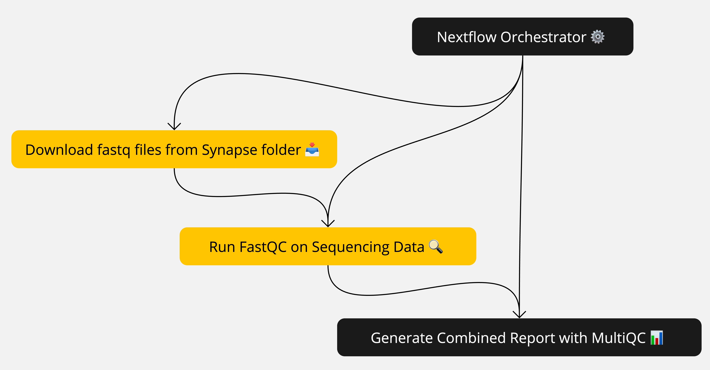

# Nextflow Pipeline for Genomic Data QC and MultiQC Reporting

## Overview
This pipeline is designed to download `.fastq.gz` files from a Synapse repository, run quality control (QC) using FastQC, and generate a combined report using MultiQC. The workflow is implemented using Nextflow for easy reproducibility and extensibility.



## Requirements
- **Nextflow**: Version 24.04.3 or later. Install from [nextflow.io](https://www.nextflow.io/).
- **Java**: Required for running Nextflow.
- **Python**: Python 3.x must be installed.
- **SynapseClient**: Install using `pip install synapseclient`.
- **FastQC** and **MultiQC**: Ensure these tools are installed and available in your `PATH`, or use containers.

Alternatively, you can use the provided `install_dependencies.sh` script to install all necessary dependencies:

```bash
./install_dependencies.sh
```

## Installation
1. Clone this repository:
   ```bash
   git clone https://github.com/yourusername/project.git
   cd project
   ```

2. Ensure dependencies are installed:
   ```bash
   pip install synapseclient
   ```

3. Log in to Synapse:
   - Use `synapse login` or ensure you have a `.synapseConfig` file set up in your home directory.


## Running the Pipeline
Run the pipeline with a specified Synapse ID:

```bash
nextflow run main.nf --synapse_id <your_synapse_id>
```

### Parameters
- `--synapse_id`: The Synapse ID of the data folder or file containing `.fastq.gz` files (e.g., `syn22093319`).

## Testing Instructions

To test the workflow, you can use the folder `syn64097744` as the test folder. The files required for testing are also included in this folder.

To run the test, use the following command:

```bash
nextflow run main.nf --synapse_id syn64097744
```

This command will execute the workflow using the provided test folder and its contents.

## Workflow Steps
1. **Download Data**: Data is downloaded from Synapse using the given Synapse ID.
2. **Run FastQC**: Each `.fastq.gz` file is processed using FastQC to generate quality control metrics.
3. **Run MultiQC**: The outputs from all FastQC runs are aggregated into a single report using MultiQC.

## Output
- **FastQC Results**: Individual FastQC result files are stored in the `results/fastqc/` directory.
- **MultiQC Report**: The pipeline generates a `multiqc_report.html` file that combines all the QC outputs in a single report, saved in the `results/` directory.

## Folder Structure
- `results/`: Directory where the quality control reports will be generated after running the workflow.

## Troubleshooting
- Ensure Synapse authentication is set up properly.
- Verify that `FastQC` and `MultiQC` are installed or available in your container.

## License
This project is licensed under the MIT License.

